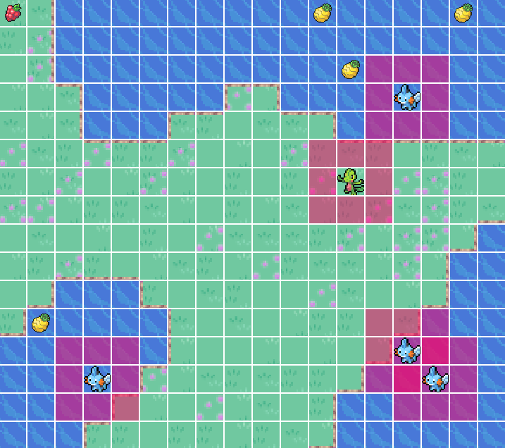

# Terrarium :leaves:
A natural ecosystem simulator for reinforcement learning agents.

The environment is defined by a discrete space conformed by the positions in a nxn grid, so the movement of the agents is limited to up,down,left and right.

In the reinforcement learning context, this is a partially observed environment, because each agent can only see in its own observation range, represented by the red squares.

### Installing depencies

pip install -r requirements.txt

### User guide

execute test_env.py

At the moment there is no traning (to be implemented), agents just move randomly.

