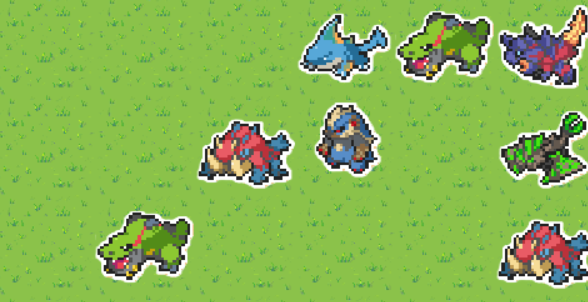

# Terrarium :leaves:
A natural ecosystem simulator for reinforcement learning agents.

The sprites for the agents are beasts from monster hunter and the art is performed by [Ezerart](https://x.com/EzerArt_)

### Installing depencies

pip install -r requirements.txt

### User guide

execute test_env.py

At the moment there is no traning (to be implemented), agents just move randomly.

