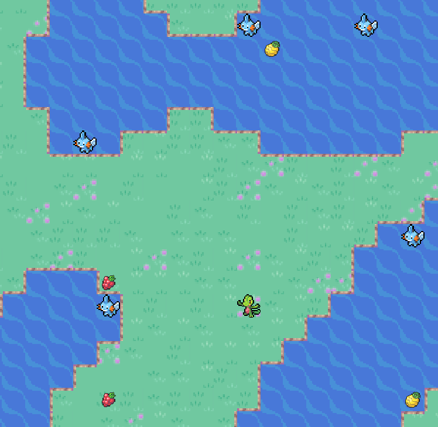

# Terrarium :leaves:
A natural environment generator to test algorithms for intelligent agents

### Installing depencies

pip install -r requirements.txt

### User guide

execute test_env.py

At the moment there is no traning (to be implemented), agents just move randomly.

